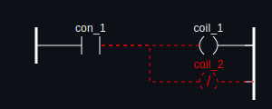
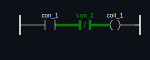
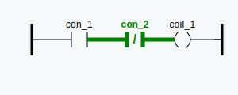

# DiffLad
A tool for rendering and diffing ladder logic programs for OpenPLC

## What is does
This tool processes ladder logic programs and renders the difference between two versions of it like this:

**DARK MODE**
<p>
  
  
</p>

**LIGHT MODE**
<p>
  
  
</p>

Alternatively, you can render one version of the diagram without the diff.

Additionally, the tool provides accessibility features for colorblind users by highlighting deletions and insertions with additional styling (dashed for deletions, bold for insertions)

## How to use it
**PREREQUISITE: ensure git is installed as DiffLad relies on its versioning system**

To use the tool, simply use the `difflad` command with the following flags:

|parameter|meaning|values|default|required|
|----|-------|------|-------|---|
|--file|path to the file to be parsed| | | ✅ |
|--pou|name of the program to be parsed (so far only one at a time, a stiched side-by-side view of all programs is in development)| | | ✅ |
|--ref|refs to diff between, either one or two (repeated flag, meaning `--ref %first%` `--ref %second%`), if omitted - the tool renders the version at the HEAD of the current branch without a diff| | `HEAD` | ❌ |
|--style| style for the diagram, can choose between light and dark mode at the moment | `light`, `dark` | `dark` | ❌ |
|--output| output folder for the `.svg` files, if omitted - a temporary folder is automatically created| | | ❌ |

After parsing is done - the output folder with generated diagrams opens automatically.

## Considerations for the diffing algorithm

The tool is using a very shallow diffing algorithm at the moment relying on OpenPLCs own internal element IDs. For example, let's take a look at one of the elements in a raw diagram XML file:
```
<contact localId="3" negated="true" width="21" height="20">
    <position x="240" y="200"/>
    <connectionPointIn>
    <relPosition x="0" y="10"/>
    <connection refLocalId="15">
        <position x="240" y="210"/>
        <position x="121" y="210"/>
    </connection>
    </connectionPointIn>
    <connectionPointOut>
    <relPosition x="21" y="10"/>
    </connectionPointOut>
    <variable>con_closed</variable>
</contact>
```
as you can see, each element has a `localId` attribute. When diffing, each element's identity is identified by its ID. If an element has been deleted, then recreated and put in the same exact position - it may have a different ID, so keep that in mind. A more deep algorithm is also possible, but for the initial version it is intentionally kept simple unless there's an explicit need.